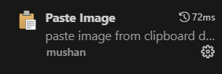
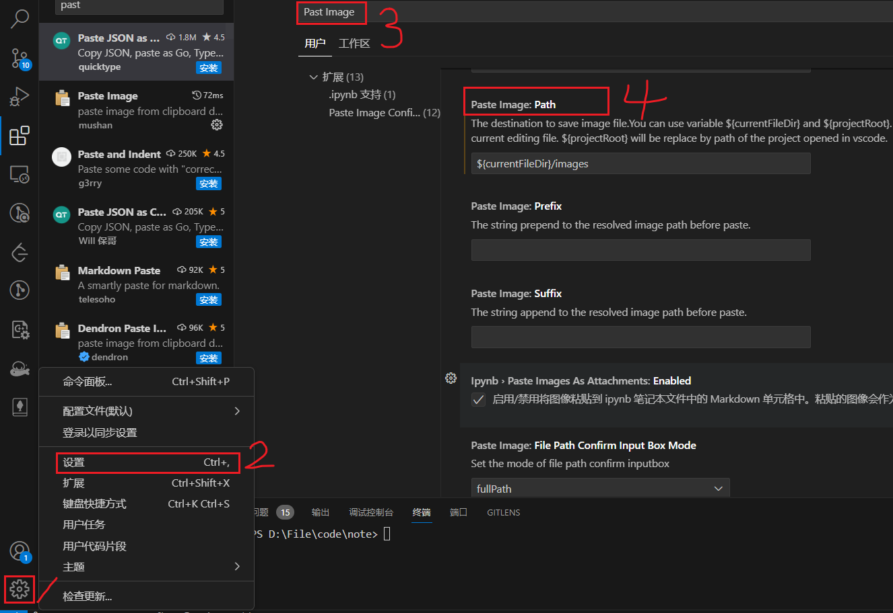

## 笔记使用步骤
1. 在桌面执行bash终端
2. `./init.sh -n`

### 创建日志
- `./tool.sh -d`

### 日志提交步骤
- 每日提交一次github

## 使用markdown
1. 使用快捷键 `shift + ctrl + m` 打开预览
2. 使用快捷键 `ctrl + alt + v` 粘贴截图
3. 截图在当前.md文件同级目录下

## markdown支持粘贴截图
1. 安装插件 `Paste Image`



2. 设置默认图片存放路径



3. 将 `Paste Image: Path` 中的内容替换为 `${currentFileDir}/images`
- 会自动在当前目录创建images目录并保存截图

- shell 文件是否存在

```
if test -e /path/to/file; then
    echo "File exists."
else
    echo "File does not exist."
fi
```

## date

- 仅获取日期字符串（格式为年-月-日）


date +"%Y-%m-%d %H:%M:%S"
```
## grep
- 递归查询文件中的字符串

- `grep "log_format" /cfg/SHB2C  -nr`
